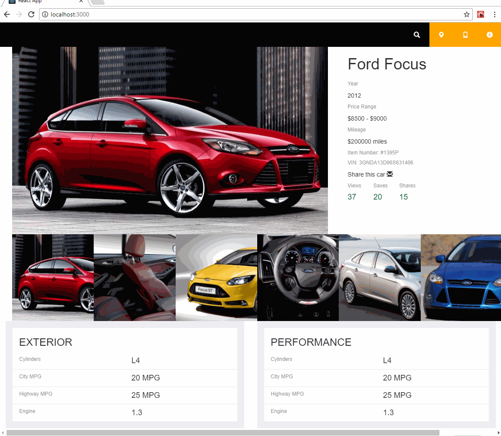

# TangoCode WebTask #

This solution contains two projects, one for the server and one for the client.

## Server ##

The server project is a [NodeJS](https://nodejs.org) web app using [Express](http://expressjs.com/) web framework.

It serves two types of requests:  
`/car/:carId` returns a json with the stores information about a car, with its images.  
`/images/:imageId` serves an image from the `images` folder.

The data is saved on a [SQLite](http://sqlite.org/) database at the root of the project called `database.db` (it has only one preloaded car)

The images for the cars are stored in the file system under the `images` folder.

## Client ##

The client is a [ReactJS](https://reactjs.org/) app created with the [Create React App](https://www.npmjs.com/package/create-react-app) npm package. It also uses [React-Bootstrap](https://react-bootstrap.github.io/) in order to easily work with adaptable components and their layouts.

## Install ## 

`npm install` from the root of each project to install the dependencies.

To start the web server open a terminal window, go to the server folder and just type `node app.js`

To start the client open a terminal window, go to the client folder and just type `npm start`
